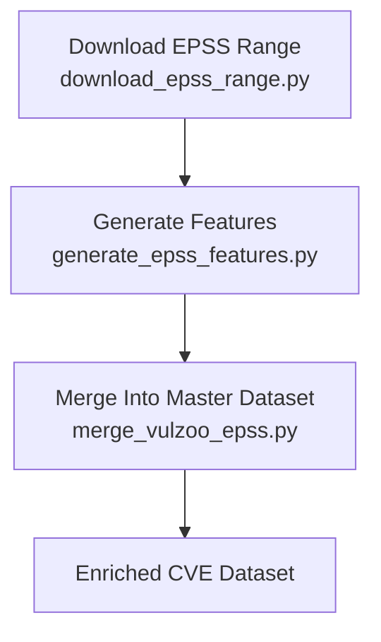

# EPSS & VulZoo Processing Pipeline

This folder contains a three-stage pipeline for downloading historical EPSS data, generating statistical EPSS features, and merging them into a unified enriched vulnerability dataset -- VulZoo.

The pipeline is designed to support vulnerability research, risk scoring, and automated remediation frameworks such as **OptiAstra**.

## 1. `get_epss_range.py`

### **Download Historical EPSS Data**

This script downloads EPSS daily CSV snapshots from FIRST.org over a user-defined date range.

**Purpose**

* Build a local archive of historical EPSS data
* Prepare inputs for feature engineering
* Enable time-series analysis of CVE exploitability

**Usage**

```bash
python3 download_epss_range.py --start 2024-01-01 --end 2024-12-31
```

**Output**

```
data/epss_raw/YYYY-MM-DD.csv
```

## 2. `epss_features.py`

### **Generate EPSS Statistical Features**

This script processes the raw EPSS files and computes per-CVE statistical features, including:

* Latest EPSS score
* 7-day / 30-day trends
* Percentile ranking
* Rolling averages
* Historical EPSS stability

These features are used later in vulnerability scoring and prioritization.

**Usage**

```bash
python3 generate_epss_features.py --raw data/epss_raw --out epss_features.parquet
```

**Output Example Fields**

```
cve_id
epss_latest
epss_d7_mean
epss_d30_max
epss_trend_7d
epss_percentile_latest
```

## 3. `merge_dataset.py`

### **Merge VulZoo + EPSS + Additional Data Sources**

This script combines:

* **VulZoo** CVE metadata
* **EPSS features** from the previous step
* **NVD fields** (CVSS, CWE, descriptions)
* **Exploit-DB** (PoCs)
* **Patch databases**

It produces a unified vulnerability dataset used for downstream LLM reasoning, risk scoring, and automated remediation.

**Usage**

```bash
python3 merge_vulzoo_epss.py
```

**Final Output**

```
cve_master_2024_2025_enriched.csv
cve_master_2024_2025_enriched.parquet
```

## Summary Workflow



## What This Pipeline Enables

* Time-series exploitability analysis
* Risk scoring (EPSS + CVSS + PoC + patch availability)
* Data preparation for **LLM-based vulnerability reasoning**
* Feeding OptiAstra’s **ΔRisk / Patch Value Optimization** models

